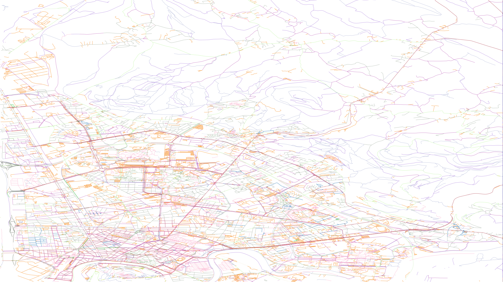
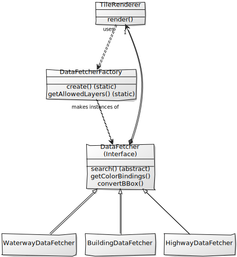

# Projet d'utilisation de systèmes géograhiques
HADI GONI BOULAMA Ibrahima , MOUSS Wassim, NGUETSOP KENFACK DJOUAKA Roy Paulin Justo, PEIRONE Lucas, POTONG MBOUCHEKO Valderane
## Mise en place

Installez `pg_config`. Sous ubuntu/Debian, il se trouve dans le package `postgresql-devel`

Ensuite vous pourrez installer les dépendances Python avec

    sudo pip install -r requirements.txt

Il suffit ensuite d'éxécuter le fichier du serveur (`WMSserver.py`).

Les fichiers `Q11.py` et `Q12.py` sont juste là pour leurs questions respectives, il ne font pas en soit parti de l'évolution "finale" du projet.

## Liste des fonctionallités disponibles

- [x] Bâtiments (Affreusement long, à utiliser avec modération) 
- [x] Routes 
- [x] Rivières 

Exemple de rendu (sans le fond de carte, question 12):

## Architecture

L'architecture de l'application est prévue pour être étendue de la manière la plus simple possible.

Le serveur Web, après avoir vérifié la justesse des paramètres, instancie la classe **TileRenderer**. 
Cette classe, comme son nom l'indique, va s'occuper de générer les images pngs demandées par le serveur.

La génération d'une *Tile*, d'une partie de l'image, s'effectue toujours de la même manière : on récupère les données formatées par deux colonnes, une colonne qui sert d'identifiant, notamment utile pour savoir de quelles couleurs nous devons
dessiner les données, et le *Linestring* représentant la forme à dessiner.

En sachant cela, nous pouvons séparer complémetement le processus de génération d'une *Tile* en deux étapes distinctes : 
La récupération des données et le dessin à proprement parler.

C'est le principe de l'architecture utilisée ici. Ainsi, la classe **TileRenderer** délègue la récupération des données à une autre classe : **DataFetcher**. Nous utilisons ici le pattern `Strategy` en conjonction avec le pattern `Factory`. 

Chaque "stratégie" correspond en fait à un type de données à récupérer, la classe **HighwayDataFetcher** récupérant les données relatives aux routes, la classe **BuildingDataFetcher**  les données relatives aux bâtiments...

Pour connaître la sous-classe de stratégie à utiliser en fonction de la couche de carte demandée par l'utilisateur, nous utilisons **DataFetcherFactory**. Cette sous-classe instancie à la demande une stratégie en fonction de la couche demandée. Elle permet également d'explicitement demander quelles stratégies sont disponibles, sans savoir à explicitement les lister dans le serveur Web. 

Quelque chose à noter est que les stratégies implémentées sont très souvent très peu différentes, l'attribut de "tags" utilisé étant souvent la seule différence notable. Il aurait également été possible de rajouter une variable sans implémenter le pattern en lui-même. Cependant, si cette implémentation est un peu verbeuse, elle n'est absolument pas dépendante de la requête SQL utilisée, et tant que les données en sortie sont formatées correctement, il est possible d'utiliser n'importe quelle requête. Cela augmente les possibilités pour étendre l'application.

## La génération d'une image

Une image est générée à partir d'une *Bounding Box*, un rectangle passé en paramètre par le serveur Web. Le **TileRenderer** s'occupe ensuite de transformer les données, notamment en les redimensionnant à la taille demandée de l'image. 

En théorie, n'importe quel système de coordonées accepté par Postgis est supporté, le **TileRenderer** va transformer le système source en 4326 pour ses traitements, évitant une bonne partie des mauvaises surprises que des calculs sur un système plus exotique pourrait réserver.

Les couleurs sont soit définies dans le code, soit définies aléatoirement. 

Les images sont mises en cache dans le répertoire temporaire de l'ordinateur hébergeant le serveur. Les noms des fichiers sont identifiés de manière unique avec le type de carte demandé, la résolution et la zone demandée.

## Tentatives d'optimisation

La grande latence de la base de données rend toute opération douloureuse. Pour les opérations les plus lourdes comme l'affichage des bâtiments, des temps de latence d'une dizaine de minutes peuvent peuvent être observés, ce qui est beaucoup, beaucoup trop.

Il n'est pas possible dans le cadre de ce projet en particulier d'optimiser la base de données en elle-même, n'ayant pas les accès nécessaires pour placer index ou clusters.

Nous pouvons néanmoins essayer de paraléliser le rendu des *Tiles*. En effet, comme le temps perdu est un temps consacré aux entrées sorties de l'application, nous pouvons lancer de multiples requêtes en parallèle, le processeur n'étant pas vraiment saturé.

La première étape a donc été de tranformer la connexion à la base de données disponible dans le fichier `database.py` pour gérer un ensemble de connexions au lieu d'une seule. 
Ce *pool* de connexions diponibles est emprunté par un thread générant une *Tile*, puis rendue au *pool* sans être fermée. À la fermeture de l'application, toutes les connexions de l'ensemble sont fermées en même temps. La taille du *pool* est régalage dans le fichier `config.py`.

Maintenant qu'il est possible de gérer plusieurs connexions à la base de données, il faut légérement modifier le serveur. Le HTTP serveur de python ne gère qu'une seule requête à la fois, et attends qu'une requête soit terminée avant de passer à la suivante dans la liste. 

Nous modifions simplement la classe du serveur en **ThreadingHTTPServer** et châque requête reçue lance un nouveau Thread.

Un autre problème émerge alors, chaque client peut lancer un nombre très important de requêtes en même temps, et le *pool* de connexions n'est pas infini. Ce problème est réglé par l'utilisation d'une sémaphore, qui limite le nombre de *Tile* pouvant être générées en même temps (mais ne limite pas la récupération à partir du cache).

La Global Interpreter Lock de Python rend l'utilisation de threads assez peu efficace par rapport à l'utilisation de processus. Cependant, ici, le facteur limitant est la base de données, donc il n'y a pas vraiment de bénéfice réel à avoir une implémentation plus optimisée. 

## Tests effectués

Les tests effectués sont assez simples. Le temps étant plutôt contraint, comparer l'image obtenue avec un résultat idéal aurait pris trop de temps. Le ficher `test.py` sert de base de test pour s'affranchir du serveur et la vérification est visuelle.